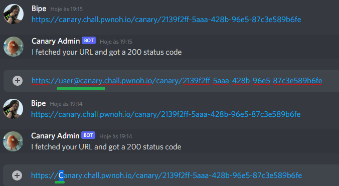

# Canary

**Category**: web \
**Points**: 70 (53 solves) \
**Author**: qxxxb

## Challenge

Ever heard of ```https://canarytokens.com```? I made something like that but it DMs you on Discord instead. You can test it out with Canary#9846.

If you find anything interesting, pass it along to Canary Admin#6625

Difficulty: easy

## Overview

There are 2 bots on discord, Canary and Canary Admin. Asking Canary for ```/info``` in it's DMs, we get both the source codes: ```http://github.com/qxxxb/canary```. 

The CanaryBot generates a honeypot URL and DM us everytime someone sends a request to it. The admin bot just visit the URL we ask it to visit.

The whole challenge consists in use the two bots to hijack a cookie and then retrieve the flag passing it via a http request, bypassing the "same origin like" verifications made by the admin.

## Solution

Analyzing the code from the Canary bot, we find the endpoint that hands us the flag. But we must send the admin cookie in order to get a reply.

```typescript
server.get(
  '/flag',
  async (request, reply) => {
    if (request.headers.cookie !== undefined) {
      const cookies = parseCookies(request.headers.cookie)
      if (cookies.auth === ADMIN_SECRET) {
        await reply.send(FLAG)
        return
      }
    }

    await reply.code(403).send(new Error("You're not the admin"))
  }
)
```

Sending our own canary URL to the admin doesn't work. The validations are the following:
```typescript
if (
      message.content.startsWith(`http://${APP_HOSTNAME}`) ||
      message.content.startsWith(`https://${APP_HOSTNAME}`)
    ) {
      message.channel.send("I see you're trying to steal my cookie :rage:")
      return
    }
```

But when the URL does work and gets visited, the cookie header is attached:

```typescript
const cookie = new Cookie({
      key: 'auth',
      value: ADMIN_SECRET,
      domain: APP_HOSTNAME
    })

jar.setCookieSync(cookie, `https://${APP_HOSTNAME}`)

const client = wrapper(axios.create({ jar }))
const response = await client.get(message.content, { maxRedirects: 0 })
```

From here, we can follow two solutions that would work:

1.  Send our URL in "user@domain" format (because it isn't stored in this format on APP_HOSTNAME)
2.  Send our original URL with any uppercase variation (because the validation isn't case sensitive)

Here, you can see both working. Discord automatically prints it in default fashion (lowercase domain only) but the URLs were sent the way shown below.



After the admin request, Canary bot sends us the request:

```
host: canary.chall.pwnoh.io
user-agent: axios/0.23.0
accept: application/json, text/plain, */*
cookie: **auth=d5692713322d63c8627ce39151943b82**
x-forwarded-host: canary.chall.pwnoh.io
x-forwarded-port: 443
x-forwarded-proto: https
x-forwarded-server: ip-10-0-0-237.us-east-2.compute.internal
accept-encoding: gzip
```

So we have the cookie. Now, just do a POST on ```canary.chall.pwnoh.io/flag``` with the request header ```cookie```: ```auth=d5692713322d63c8627ce39151943b82``` to get the flag.


FLAG: 

```buckeye{d0ma1n_m4tch1ng_1s_c4s5_1ns3nsit1v3}```