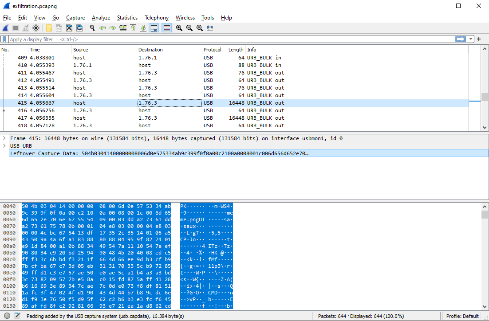

# USB Exfiltration

**Category**: misc \
**Points**: 252 (106 solves) \
**Author**: arcsolstice

## Challenge

Someone stole data from our servers and you need to figure out exactly what they took or you're fired! We know they zipped the files then transferred them via USB somehow so here's a capture of the USB traffic. You should be able to recover the files from that, right?

Attachments: ```exfiltration.pcapng```

Difficulty: medium

## Overview

There's a .pcapng file with USB data traffic. Using wireshark, we can't "follow" a stream, but we do see packets with big sizes among small ones. Inside these big packets, we find some file signatures like the .zip PK and so on. Filtering the real file transfer packets and concatenating them must lead us somewhere.

## Solution

Opening the .pcapng file, we find the host and the external USB trading packets (the ones marked as ```URB_BULK in``` or ```URB_BULK out```). Most of them are small ones (len < 100), but at the 415th packet, we start to find some big ones. In addition, we notice the "PK" file signature, which indicates a .zip file.



In Wireshark, we can right-click any packet data and select Apply as an filter -> select (or "... and selected" for the next ones ). This way we reach the final filter for all the "sent" data:  ```(usb.src == "host") && (frame.len > 200) ```. Furthermore, we can go to File -> Export Specified Packets to generate a .pcapng file with the data flow we need.

Using Scapy (packet manipulation python lib), we are able to navigate through the new ```filtered.pcapng```. If we concatenate the data of those packets (total of 42), we can recreate the data. The solve (```solve.py```):

```python
from scapy.all import *
packets = rdpcap('./filtered.pcapng')
data = b""
#0 to 41 because there are only the filtered packets in this .pcapng file
i = 0  
while i<=41:
	data += raw(packets[i])[64:]
	i+=1
f = open("zipped", "wb")
f.write(data)
```

```
bipe@ava40l:~$  file zipped
zipped: Zip archive data, at least v2.0 to extract
bipe@ava40l:~$  unzip zipped
Archive:  zipped
  inflating: meme.png
  inflating: flag.b64
```

Decoding the base64 flag.b64 file, we reach the result.

FLAG: 

```buckeye{why_1snt_7h3r3_4_di55ect0r_4_th1s}```