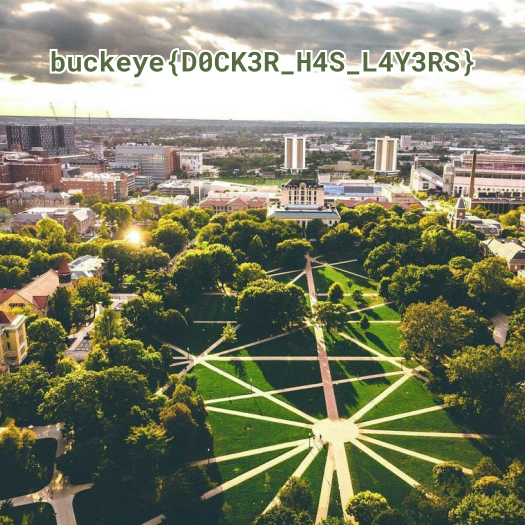

# layers

**Category**: misc \
**Points**: 30 (144 solves) \
**Author**: qxxxb

## Challenge

Check out my brand new docker repo `https://hub.docker.com/r/qxxxb/layers`

Difficulty: easy

## Overview

We have a docker hub image. At the 'layers' tab we can see that there once was a flag.png file that was deleted in another layer.

## Solution

We know that a ```flag.png``` file used to exist but it got deleted in another layer of the image. After pulling the image with ```docker pull qxxxb/layers:latest```, we are able to inspect it with ```docker inspect qxxxb/layers```:

```bash
root@ava40l:/var/lib/docker# docker inspect qxxxb/layers
[
    {
        "Id": "sha256:0c01a25ae5b745b06c68c7b870b848f327227e06feca8f121c105d3cc423ebc9",
        "RepoTags": [
            "qxxxb/layers:latest"
        ],
        "RepoDigests": [
            "qxxxb/layers@sha256:a89678536727abc0fbfe693b19ac0f8454502351dc792dabbee47bc9ab7420b2"
        ],
        "Parent": "",
        "Comment": "",
        "Created": "2021-10-19T15:26:49.240573536Z",
        "Container": "f6fb5543fac6f92af65af594f2547a659761eecfa1cafd720d631e6ca2bb0e1e",
        "ContainerConfig": {
            "Hostname": "",
            "Domainname": "",
            "User": "",
            "AttachStdin": false,
            "AttachStdout": false,
            "AttachStderr": false,
            "Tty": false,
            "OpenStdin": false,
            "StdinOnce": false,
            "Env": [
                "PATH=/usr/local/sbin:/usr/local/bin:/usr/sbin:/usr/bin:/sbin:/bin"
            ],
            "Cmd": [
                "/bin/sh",
                "-c",
                "echo \"Sorry, the flag has been deleted :(\" > /message.txt"
            ],
            "Image": "sha256:d6aa6df23fb1b311908fad5a8eb92626650ece786144bc04e6ca02a3807fb02e",
            "Volumes": null,
            "WorkingDir": "",
            "Entrypoint": null,
            "OnBuild": null,
            "Labels": null
        },
        "DockerVersion": "20.10.6",
        "Author": "",
        "Config": {
            "Hostname": "",
            "Domainname": "",
            "User": "",
            "AttachStdin": false,
            "AttachStdout": false,
            "AttachStderr": false,
            "Tty": false,
            "OpenStdin": false,
            "StdinOnce": false,
            "Env": [
                "PATH=/usr/local/sbin:/usr/local/bin:/usr/sbin:/usr/bin:/sbin:/bin"
            ],
            "Cmd": [
                "/bin/sh"
            ],
            "Image": "sha256:d6aa6df23fb1b311908fad5a8eb92626650ece786144bc04e6ca02a3807fb02e",
            "Volumes": null,
            "WorkingDir": "",
            "Entrypoint": null,
            "OnBuild": null,
            "Labels": null
        },
        "Architecture": "amd64",
        "Os": "linux",
        "Size": 6194599,
        "VirtualSize": 6194599,
        "GraphDriver": {
            "Data": {
                "LowerDir": "/var/lib/docker/overlay2/18abe255ca67e2297a2922712d99c3d8e3d6bdd4c1b9ed587d9c464d848da863/diff:/var/lib/docker/overlay2/b4ccd70a0acefba4788efd23ef7dc468895be20a74c489778bb464d94fe6a28a/diff:/var/lib/docker/overlay2/1dde6d634eb2c0a9996d139cceed9cd99eb921319a5b2a783b0108e39a562a56/diff",
                "MergedDir": "/var/lib/docker/overlay2/1135ab42f4838efa1b0624e044424e106837bc6a1934929aa624d3240b297b0b/merged",
                "UpperDir": "/var/lib/docker/overlay2/1135ab42f4838efa1b0624e044424e106837bc6a1934929aa624d3240b297b0b/diff",
                "WorkDir": "/var/lib/docker/overlay2/1135ab42f4838efa1b0624e044424e106837bc6a1934929aa624d3240b297b0b/work"
            },
            "Name": "overlay2"
        },
        "RootFS": {
            "Type": "layers",
            "Layers": [
                "sha256:e2eb06d8af8218cfec8210147357a68b7e13f7c485b991c288c2d01dc228bb68",
                "sha256:a6951987fab1e53365680416db4c728a89783aa2b8c39bd2879aabfcffab95d9",
                "sha256:3d2c9f04c82dbb90411e102ed7e2e49b412b03e2f0021a40d3af818e02cdd0f7",
                "sha256:50d11bbfd2f65f57406491bdd23baad9a62672b8080d243a590c37e7dc7eab73"
            ]
        },
        "Metadata": {
            "LastTagTime": "0001-01-01T00:00:00Z"
        }
    }
]
```

Overlay2 filesystem (in my machine, ```/var/lib/docker/overlay2```) is used by docker images and containers. The ```Data``` on inspect have 3 sections. LowerDir directory have the read-only layers of the image. 

Inside LowerDir, we have 3 different folders:
```
/var/lib/docker/overlay2/18abe255ca67e2297a2922712d99c3d8e3d6bdd4c1b9ed587d9c464d848da863/diff
/var/lib/docker/overlay2/b4ccd70a0acefba4788efd23ef7dc468895be20a74c489778bb464d94fe6a28a/diff
/var/lib/docker/overlay2/1dde6d634eb2c0a9996d139cceed9cd99eb921319a5b2a783b0108e39a562a56/diff
```

The first one has a ```flag.png``` file, but it isn't readable:

```bash
root@ava40l:/var/lib/docker# cd /var/lib/docker/overlay2/18abe255ca67e2297a2922712d99c3d8e3d6bdd4c1b9ed587d9c464d848da863/diff/

root@ava40l:/var/lib/docker/overlay2/18abe255ca67e2297a2922712d99c3d8e3d6bdd4c1b9ed587d9c464d848da863/diff# ls
flag.png

root@ava40l:/var/lib/docker/overlay2/18abe255ca67e2297a2922712d99c3d8e3d6bdd4c1b9ed587d9c464d848da863/diff# file flag.png 
flag.png: character special (0/0)
```

In the second folder, we find another ```flag.png``` file, this time, as a PNG image:

```bash
root@ava40l:/var/lib/docker/overlay2# cd b4ccd70a0acefba4788efd23ef7dc468895be20a74c489778bb464d94fe6a28a/diff/

root@ava40l:/var/lib/docker/overlay2/b4ccd70a0acefba4788efd23ef7dc468895be20a74c489778bb464d94fe6a28a/diff# ls
Dockerfile  flag.png

root@ava40l:/var/lib/docker/overlay2/b4ccd70a0acefba4788efd23ef7dc468895be20a74c489778bb464d94fe6a28a/diff# file flag.png 
flag.png: PNG image data, 525 x 525, 8-bit/color RGBA, non-interlaced
```

We can open it and retrieve the flag:

```bash
root@ava40l:/var/lib/docker/overlay2/b4ccd70a0acefba4788efd23ef7dc468895be20a74c489778bb464d94fe6a28a/diff# xdg-open flag.png
```



FLAG: 

```buckeye{D0CK3R_H4S_L4Y3RS}```