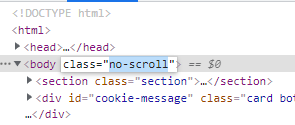

# bunnydance

**Category**: Web \
**Points**: 50 (247 solves) \
**Author**: qxxxb

## Challenge

Kyle started an online magazine (The Daily Kyle) and published one of my articles on his site.

Don't worry, the article literally contains the flag in plaintext, but if you want to read it you'll have to figure out how to bypass the paywall.

Difficulty: Easy

`https://pay2win.chall.pwnoh.io`

## Overview

The page is filled with popups, paywalls, scroll-locks and more events triggered by user input. You have to make your way through the article to find the flag.

## Solution

Using the devtools redirects you to a youtube page (what could it be :thinking:). Curl the URL also doesn't give you the flag, just the empty html container. So, at first, I thought about using a prerender service (like [this one]).

If you curl a pre-rendered page, you get the html modified by its scripts actions instead of the raw html. Crawlers use it to index SPAs in search engines.

```
curl http://localhost:3000/https://pay2win.chall.pwnoh.io
```

Resulted in this:


This is probably the flag, but the char's are out of order. We could bruteforce all possible combinations of this chars, but it's actually very easier.

Going back to the devtools, if a breakpoint is set at the beginning of the js script, you can change it and the changes will be executed while you don't refresh the page.


With the script paused, we find the function responsible for the "flag deployment"

```javascript
function plantFlag () {
  const ciphertext = [234, 240, 234, 252, 214, 236, 140, 247, 173, 191, 158, 132, 56, 4, 32, 73, 235, 193, 233, 152, 125, 19, 19, 237, 186, 131, 98, 52, 186, 143, 127, 43, 226, 233, 126, 15, 225, 171, 85, 55, 173, 123, 21, 147, 97, 21, 237, 11, 254, 129, 2, 131, 101, 63, 149, 61]
  const plaintext = ciphertext.map((x, i) => ((i * i) % 256) ^ x ^ 0x99)

  const flagElement = document.querySelector('#flag')
  plaintext.map((x, i) => {
    const span = document.createElement('span')
    span.classList.add(`flag-char-${i}`)
    span.textContent = String.fromCharCode(x)
    flagElement.appendChild(span)
    return span
  })

  const flagOverlay = document.querySelector('#flag-overlay')
  flagOverlay.addEventListener('mouseover', async () => {
    await swal(flagAlert)
  })
}
```

So we can see the ciphertext and how it was decoded. But insted of reverse it, let's keep it simple.

In the script, we find the youtube redirect function. We can comment the ```window.location.href``` line and set another breakpoint in the end of the flag function. By doing this, we prevent redirecting and can press "play" in the script execution, making it pause just after deploying the flag in the document.


The script is paused again, but we can't scroll the paused page. This happened because this function added ```no-scroll``` class to the html's body during execution:

```javascript
async function doAlert (config, force = false) {
  if (!alerting || force) {
    alerting = true
    document.body.classList.add('no-scroll')
    await swal(config)
    document.body.classList.remove('no-scroll')
    alerting = false
  }
}
```

So we can go to the "Elements" tab of the devtools and remove it manually:



Searching for "flag" on the elements tab get you to the flag-container, but it is hidden and out of order (as we could see in the prerendered curl). 


But right after the flag-chars, we can find a ```flag-overlay``` div. By selecting it, we can see it's CSS properties. It has absolute position and a gray background-color. By disabling it manually, we find the flag:


FLAG: 

```buckeye{h0ly_sh1t_wh4t_th3_h3ck_1s_th1s_w31rd_ch4ll3ng3}```

[this one]: https://docs.prerender.io/article/14-test-it